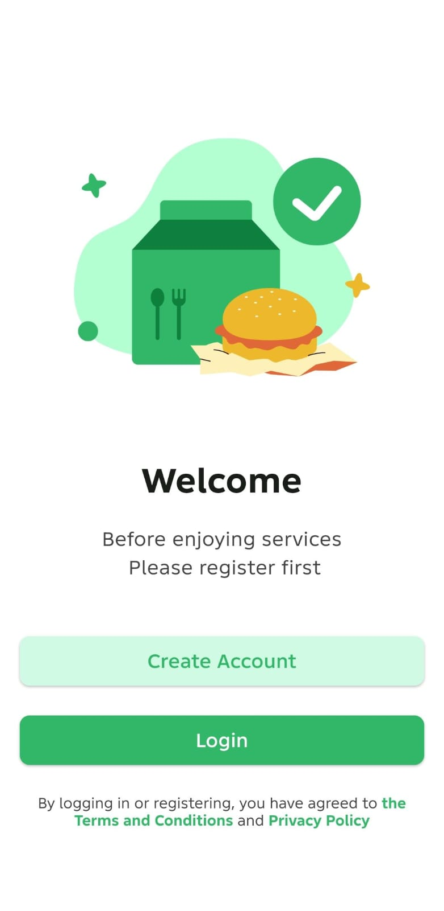
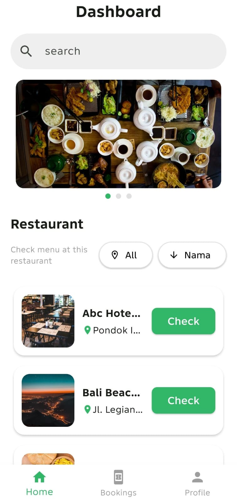
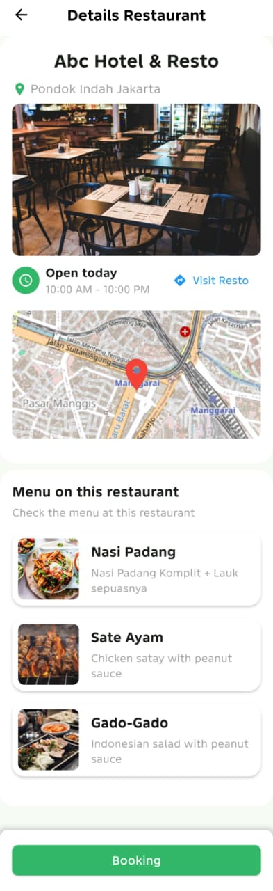

# Booking Resto

A mobile application for browsing restaurants and making restaurant bookings.

This project was developed using Flutter as part of my learning process in mobile application development.

## Features

* **Authentication**

  * Register and log in using Firebase Authentication.

* **Restaurant List**

  * Display a list of restaurants from several regions.
  * Restaurant data is loaded from a local `data.json` file.

* **Restaurant Detail**

  * Display detailed information about each restaurant.

* **Restaurant Booking**

  * Users can make restaurant bookings.
  * Booking data is stored using Firebase Cloud Firestore.

* **User Authentication**

  * Users can access the application's features after logging in.

## Tech Stack

* **Flutter**
* **Dart**
* **Firebase Authentication**
* **Firebase Cloud Firestore**
* **JSON** — used as a local data source for restaurant information

## Data Source

The restaurant data used in this application is stored locally in a `data.json` file.

The file contains information about restaurants from several regions and is used to display the restaurant list and restaurant details.

## Firebase

The application uses Firebase for the following purposes:

* **Firebase Authentication** for user registration and login.
* **Cloud Firestore** for storing restaurant booking data.

## Screenshots

Here are some screenshots of the application:

* Welcome 
  
  

* Restaurant List
  
  

* Restaurant Detai
  
  

* Booking List

  
